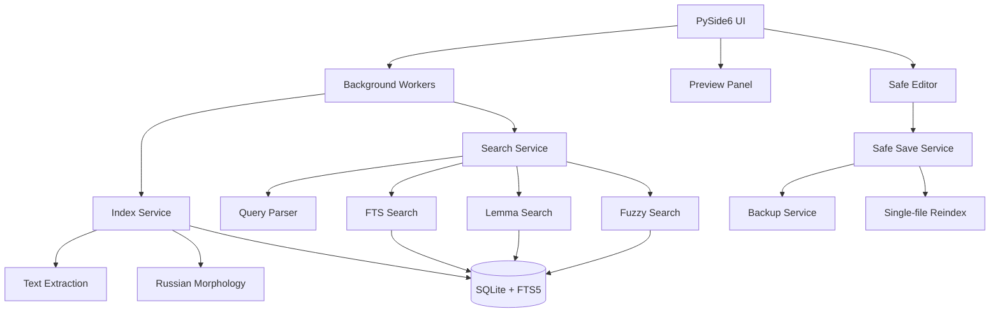

# DocuFind Local

**DocuFind Local** is a Windows desktop application for local file indexing and search. It indexes selected folders and helps find files by name, path, content, Russian word forms, and typo-tolerant fuzzy matches without sending user data to external services.

> Status: MVP. The project includes a PySide6 UI, SQLite/FTS5 search index, Russian morphology, safe text editing, tests, and PyInstaller build configuration.

---

## Why this project exists

Windows file search is often too limited when a user needs to find an exact text fragment inside local folders, especially with Russian word forms or typos. DocuFind Local provides a local-first search workflow with preview, match positions, and safe editing for supported text files.

## Features

- Index selected local folders.
- Search by filename, path, and file content.
- Full-text search through SQLite FTS5.
- Russian morphology through `pymorphy3` with a deterministic fallback for restricted environments.
- Typo-tolerant fuzzy search through RapidFuzz.
- Preview matched fragments with line/column metadata.
- Safe text editor for supported text files:
  - external-change detection;
  - backup before save;
  - atomic save through a temporary file;
  - single-file reindex after save.
- Background workers for indexing, search, and reindexing without blocking the UI.
- RU/EN interface.
- Portable/runtime folders for database, logs, and backups.
- Windows executable build through PyInstaller.
- Unit/integration tests for storage, scanner, extraction, morphology, indexing, search, fuzzy search, workers, UI, editor, and build configuration.

## Technical highlights

| Area | Implementation |
|---|---|
| Desktop UI | PySide6 |
| Storage | SQLite, WAL, migrations |
| Full-text search | SQLite FTS5 |
| Fuzzy search | RapidFuzz |
| Russian NLP | pymorphy3 + fallback analyzer |
| Indexing | scanner, filters, text extraction, chunks, terms, lemmas |
| Editor safety | conflict detection, backup, atomic save |
| Background tasks | IndexWorker, SearchWorker, ReindexWorker |
| Packaging | PyInstaller spec + build script |
| Testing | unittest suites, quality gates |

## Architecture



## Main workflow

1. The user selects a local folder.
2. The application scans files and indexes supported formats.
3. Text is split into chunks, normalized, and stored in SQLite/FTS5.
4. The user searches by filename, path, content, word forms, or typos.
5. The application returns matching files, snippets, line/column positions, and preview.
6. If a file is edited, the app creates a backup, checks for external changes, performs atomic save, and reindexes the saved file.

## Requirements

- Windows.
- Python 3.11+.
- Regular Python 3.13 is recommended for UI/build/release work. Free-threaded `3.13t` is not recommended because some binary dependencies may be unavailable.

## Install from source

```powershell
py -3.13 -m venv .venv
.\.venv\Scripts\Activate.ps1
python -m pip install --upgrade pip
python -m pip install -e ".[dev]"
```

## Run

```powershell
python -m app.main
```

Alternative without an activated virtual environment:

```powershell
py -3.13 -m app.main
```

## Tests

Run the full test suite:

```powershell
python -m unittest discover -s tests -p "test_*.py"
```

Manual release checks are documented in [`RELEASE_CHECKLIST.md`](RELEASE_CHECKLIST.md).

## Build Windows executable

```powershell
py -3.13 build_exe.py
```

Expected output:

```text
dist\DocuFindLocal.exe
```

The `dist/` and `build/` folders are not committed.

## Runtime folders

Portable/dev mode:

```text
data/
logs/
backups/
```

Installed mode:

```text
%LOCALAPPDATA%\DocuFind\
```

## Privacy and safety

- Indexing is performed locally.
- File contents are not sent to external services.
- The editor creates a backup before saving.
- If a file changed externally after being opened, save is blocked until reload.
- Logs should not contain full user file contents.

## MVP limitations

- The project targets Windows desktop usage, not web or cloud deployment.
- Single-file reindex updates only the selected file. Deleted sibling files are detected during full folder reindex.
- Russian morphology quality depends on `pymorphy3`; fallback behavior is kept for compatibility but is not a full analyzer replacement.
- PyInstaller executable size can be large because it includes PySide6 and morphology dictionaries.

## Roadmap

- Add screenshots/GIF demo to the README.
- Publish a GitHub Release with a built Windows executable.
- Add indexing benchmarks for large folders.
- Improve navigation across multiple matches inside one file.
- Expand supported file formats.
